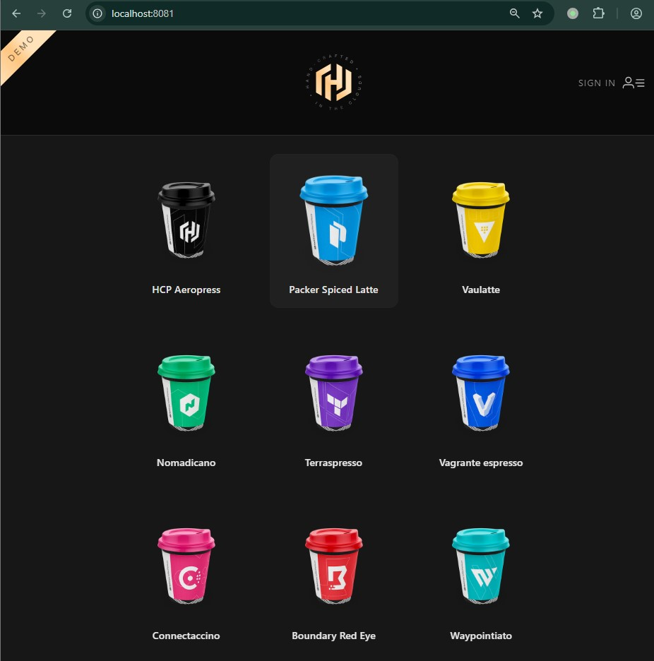
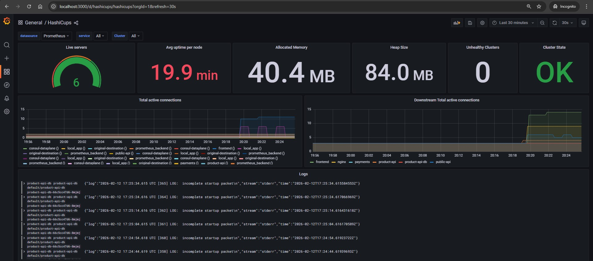
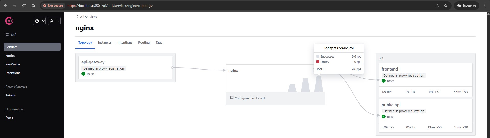

# Hashicorp consul-k8s tutorials

Links:
- https://github.com/hashicorp/consul-k8s
- https://developer.hashicorp.com/consul/tutorials/get-started-kubernetes


## Notes
- for this tutorial docker desktop is used if you are on windows

## Install Hashicorp binaries

- consul-k8s cli https://releases.hashicorp.com/consul-k8s/

### Linux

```sh
VERSION=1.9.1
curl -LO https://releases.hashicorp.com/consul-k8s/${VERSION}/consul-k8s_${VERSION}_linux_amd64.zip
unzip consul-k8s_${VERSION}_linux_amd64.zip

sudo install consul-k8s /usr/local/bin/consul-k8s
```

### Windows

- put Hashicorp exe files in `%USERPROFILE%/hashicorp/bin`
```
PS C:\Users\robez\hashicorp\bin> pwd

Path
----
C:\Users\robez\hashicorp\bin


PS C:\Users\robez\hashicorp\bin> ls


    Directory: C:\Users\robez\hashicorp\bin


Mode                 LastWriteTime         Length Name
----                 -------------         ------ ----
-a----        12/25/2025   2:42 AM      137480080 consul-k8s.exe
-a----         10/8/2024   2:23 PM      185134256 consul.exe
-a----         10/8/2024   2:25 PM       91100336 terraform.exe
```

- Edit system environment variables
    * User variables for \<USER\>
    * Path -> New
    ```
    C:\Users\robez\hashicorp\bin
    ```


## 1. Deploy Consul on Kubernetes

Links:
- [Github repo](https://developer.hashicorp.com/consul/tutorials/get-started-kubernetes/kubernetes-gs-deploy)
- https://github.com/hashicorp-education/learn-consul-get-started-kubernetes

```sh
cd learn-consul-get-started-kubernetes/self-managed/local
```

- template chart
```sh
helm template consul hashicorp/consul -n consul `
    -f helm/values-v1.yaml `
    --version 1.9.2 > rendered.yaml
```

- install consul-k8s with Helm
```sh
helm install --values helm/values-v1.yaml consul hashicorp/consul --create-namespace --namespace consul --version "1.9.2"

# with service sync
helm install --values helm/values-v1-service-sync.yaml consul hashicorp/consul --create-namespace --namespace consul --version "1.9.2"
```

- uninstall
```sh
helm uninstall consul -n consul
# helm uninstall consul -n consul --no-hooks
kubectl delete namespace consul --wait=true
```

- set default namespace
```sh
kubectl config set-context --current --namespace=consul

# kubectl config get-contexts
# kubectl config view --minify --output 'jsonpath={..namespace}'
# consul
```

- set env variables + acl token
```sh
export CONSUL_HTTP_TOKEN=$(kubectl get --namespace consul secrets/consul-bootstrap-acl-token --template={{.data.token}} | base64 -d)
export CONSUL_HTTP_ADDR=https://127.0.0.1:8501
export CONSUL_HTTP_SSL_VERIFY=false
```

- log in to Consul
```sh
kubectl -n consul port-forward svc/consul-ui --namespace consul 8501:443

# localhost:8501
```

## 2. Securely connect your services with Consul service mesh

Links:
- https://developer.hashicorp.com/consul/tutorials/get-started-kubernetes/kubernetes-gs-service-mesh

- create namespace for *hashicups*
```sh
kubectl create namespace demo
```

<!-- - create a separate namespace and label it
```sh
kubectl create namespace demo
kubectl label namespace demo consul.hashicorp.com/connect-inject=enabled
``` -->

<!-- - remove label from namespace (trailing `-` is important)
```sh
kubectl label namespace demo consul.hashicorp.com/connect-inject-
namespace/demo unlabeled

kubectl get namespace demo --show-labels
``` -->

- apply k8s manifests
```sh
kubectl -n demo apply -f hashicups/v1/
```

- list existing *Services* (note *proxy* services) and *Intentions*

This configuration deployed Consul in secure mode with ACLs set to a default deny policy and is automatically managed by Consul and Kubernetes.

This means that the only allowed service-to-service communications are the ones explicitly specified by intentions.
```sh
kubectl port-forward svc/consul-ui --namespace consul 8501:443

$ consul catalog services
consul
frontend
frontend-sidecar-proxy
nginx
nginx-sidecar-proxy
payments
payments-sidecar-proxy
product-api
product-api-db
product-api-db-sidecar-proxy
product-api-sidecar-proxy
public-api
public-api-sidecar-proxy

$ consul intention list
There are no intentions.
```

- observe *error* in `product-api` pod: *API* cannot connect to *DB*
```sh
2025-12-25T08:23:06.336Z [ERROR] Unable to connect to database: error="unexpected EOF"
2025-12-25T08:23:07.345Z [ERROR] Unable to connect to database: error="unexpected EOF"
2025-12-25T08:23:08.353Z [ERROR] Unable to connect to database: error="unexpected EOF"
2025-12-25T08:23:09.361Z [ERROR] Unable to connect to database: error="unexpected EOF"
2025-12-25T08:23:09.361Z [ERROR] Timeout waiting for database connection
```

- observe *error* `RBAC: access denied`
```sh
kubectl -n demo port-forward svc/nginx 8081:80

curl localhost:8081
RBAC: access denied
```

- apply Consul *Intentions* to allow service-to-service communication
```sh
kubectl -n demo apply -f hashicups/intentions/allow.yaml
```

- observe working app at `localhost:8081`
{width=50%}

```sh
curl -s -o /dev/null -w "%{http_code}" localhost:8081
200
```

- list *Intentions*
```sh
$ consul intention list
ID  Source       Action  Destination     Precedence
    nginx        allow   frontend        9
    nginx        allow   public-api      9
    product-api  allow   product-api-db  9
    public-api   allow   payments        9
    public-api   allow   product-api     9
```

### Misc

- Delete intentions (RECOMMENDED WAY)
```sh
# delete all intentions
kubectl -n demo delete -f hashicups/intentions/allow.yaml
# or delete individual ones:
kubectl -n demo delete serviceintentions.consul.hashicorp.com/frontend
```

- **NOT RECOMMENDED**: Delete intentions directly in Consul; you will not be able to recreate the intentions with kubectl apply -f allow.yaml
```sh
# export CONSUL_HTTP_TOKEN=$(kubectl get --namespace consul secrets/consul-bootstrap-acl-token --template={{.data.token}} | base64 -d)
# export CONSUL_HTTP_ADDR=https://127.0.0.1:8501
# export CONSUL_HTTP_SSL_VERIFY=false

consul config list -kind service-intentions
frontend
payments
product-api
product-api-db
public-api

for name in $(consul config list -kind service-intentions);
do
    echo "Deleting intention: $name"
    consul config delete -kind service-intentions -name "$name"
done

consul config list -kind service-intentions
# should be empty
```

- Restore intentions (if you deleted them directly from consul)
```sh
for r in frontend public-api product-api product-api-db payments; do
  kubectl annotate -n demo serviceintentions.consul.hashicorp.com/$r \
    consul.hashicorp.com/reconcile-at="$(date +%s)" --overwrite
done

consul config list -kind service-intentions
```

## 3. Enable external traffic ingress into Consul service mesh

Links:
- https://developer.hashicorp.com/consul/tutorials/get-started-kubernetes/kubernetes-gs-ingress

**NOTE**: observe service type for `api-gateway` service
```yaml
connectInject:
  apiGateway:
    managedGatewayClass:
      serviceType: LoadBalancer
```

```sh
helm upgrade --values helm/values-v2-service-sync.yaml consul hashicorp/consul --namespace consul --version "1.9.2"
```

```sh
# Available from values-v1
kubectl -n consul get gatewayclass
NAME     CONTROLLER                                ACCEPTED   AGE
consul   consul.hashicorp.com/gateway-controller   True       29d
```

- check consul-k8s gateway controller config for service type
```sh
$ kubectl get gatewayclassconfig consul-api-gateway -o json | jq -r '.spec.serviceType'
LoadBalancer

# $ kubectl get gatewayclassconfig consul-api-gateway -o yaml | grep serviceType
# LoadBalancer
```

### Deploy Consul API Gateway

#### Apply K8S objects

- Windows

https://developer.hashicorp.com/consul/tutorials/get-started-kubernetes/kubernetes-gs-ingress#review-consul-api-gateway-configuration-2

```sh
kubectl -n consul apply -f api-gw/consul-api-gateway.yaml && `
    kubectl -n consul wait --for=condition=accepted gateway/api-gateway --timeout=90s && `
    kubectl -n consul apply -f api-gw/routes.yaml && `
    kubectl -n consul apply -f api-gw/intentions.yaml
```

- Linux

https://developer.hashicorp.com/consul/tutorials/get-started-kubernetes/kubernetes-gs-ingress#review-consul-api-gateway-configuration-2

```sh
kubectl -n consul apply -f api-gw/consul-api-gateway.yaml && \
    kubectl -n consul wait --for=condition=accepted gateway/api-gateway --timeout=90s && \
    kubectl -n consul apply -f api-gw/routes.yaml && \
    kubectl -n consul apply -f api-gw/intentions.yaml
```

```sh
gateway.gateway.networking.k8s.io/api-gateway created
gateway.gateway.networking.k8s.io/api-gateway condition met
httproute.gateway.networking.k8s.io/http-route-1 created
serviceintentions.consul.hashicorp.com/api-gateway created
```

- Observe created API Gateway pod
```sh
$ kubectl -n consul get deploy api-gateway
NAME          READY   UP-TO-DATE   AVAILABLE   AGE
api-gateway   1/1     1            1           61m
```

#### Deploy RBAC and Reference Grant resources

```sh
$ kubectl -n demo apply -f hashicups/v2/
clusterrolebinding.rbac.authorization.k8s.io/consul-api-gateway-tokenreview-binding created
clusterrole.rbac.authorization.k8s.io/consul-api-gateway-auth created
clusterrolebinding.rbac.authorization.k8s.io/consul-api-gateway-auth-binding created
clusterrolebinding.rbac.authorization.k8s.io/consul-auth-binding created
referencegrant.gateway.networking.k8s.io/consul-reference-grant created
```

#### View Consul services

- Observe API Gateway service
```sh
# LoadBalancer
$ kubectl -n consul get svc api-gateway
NAME          TYPE           CLUSTER-IP     EXTERNAL-IP   PORT(S)                         AGE
api-gateway   LoadBalancer   10.97.44.250   localhost     8080:31855/TCP,8443:30816/TCP   53s

# NodePort
# $ kubectl -n consul get svc api-gateway
# NAME            TYPE           CLUSTER-IP      EXTERNAL-IP   PORT(S)
# api-gateway     NodePort       10.102.160.60   <none>        8080:31950/TCP
```

```sh
$ kubectl -n consul exec consul-server-0 -c consul -- sh -c "consul catalog services | grep api-gateway"
api-gateway
# api-gateway-consul # << this service comes from Consul Service Sync functionality
```

```sh
$ kubectl -n consul exec consul-server-0 -c consul -- sh -c "consul intention list"
ID  Source       Action  Destination     Precedence
    api-gateway  allow   nginx           9
    debug        allow   frontend        9
    debug        allow   public-api      9
    nginx        allow   frontend        9
    nginx        allow   public-api      9
    product-api  allow   product-api-db  9
    public-api   allow   payments        9
    public-api   allow   product-api     9
```

Access Hashicups:
- if service `consul/api-gateway` is of type `LoadBalancer` (no port-forward needed)
```sh
curl http://127.0.0.1:8080

curl -k https://127.0.0.1:8443
```
- if service `consul/api-gateway` is of type `NodePort`
```sh
curl http://127.0.0.1:31950
```

## 4. Observe Consul service mesh traffic

Links:
- https://developer.hashicorp.com/consul/tutorials/get-started-kubernetes/kubernetes-gs-observability

### Enable Consul telemetry features

- set correct namespace for Consul UI metrics source
```yaml
# helm/values-v3-service-sync.yaml
ui:
  enabled: true
  ...
  metrics:
    ...
    # baseURL: http://prometheus-server.<namespace>.svc.cluster.local
    baseURL: http://prometheus-server.monitoring.svc.cluster.local
```

**NOTE**: fix `connectInject.metrics` in `helm/values-v3-service-sync.yaml`
```yaml
# helm/values-v3-service-sync.yaml
connectInject:
  ...
  # Enables metrics for Consul Connect sidecars.
  metrics:
    defaultEnabled: true
    defaultEnableMerging: false # default: true
```
if one sets `connectInject.metrics.defaultEnableMerging: true`, then there will be an error in Prometheus targets 
```sh
strconv.ParseFloat: parsing "to": invalid syntax
```

the error comes from fetching the merged sidecar metrics output from a pod
```sh
$ kubectl -n default exec deploy/prometheus-server -c prometheus-server -- sh -c `
"wget -qO- http://10.1.1.255:20200/metrics | sed -n '2910,2925p'"

$ kubectl -n default exec deploy/prometheus-server -c prometheus-server -- sh -c `
"wget -qO- http://nginx.demo:20200/metrics | sed -n '2910,2925p'"

failed to scrape metrics at url "http://127.0.0.1:80/metrics"
```
the sidecar prints a plain-text error line into the Prometheus exposition -> `strconv.ParseFloat` error

So for your setup, leave `connectInject.metrics.defaultEnableMerging: false` unless you also ensure every app in the mesh exposes a valid Prometheus endpoint at the expected location (often `/metrics` on the service port), so the merge never emits those error lines.

---

```sh
$ helm upgrade --values helm/values-v3-service-sync.yaml consul hashicorp/consul --namespace consul --version "1.9.2"

$ kubectl -n demo apply -f proxy/proxy-defaults.yaml
proxydefaults.consul.hashicorp.com/global created
```

### Restart sidecar proxies

You need to restart your sidecar proxies to retrieve the updated proxy defaults configuration. To do so, redeploy your HashiCups services.

- delete existing HashiCups services
```sh
kubectl -n demo delete -f ./hashicups/v1/
```

- redeploy the HashiCups application
```sh
kubectl -n demo apply -f ./hashicups/v1/
```

- Confirm that your proxy defaults updated your Envoy proxy's configuration (run `port-forward` on *Envoy admin interface port* on the sidecar proxy that Consul injects into the target pod, e.g. `frontend`)
```sh
$ kubectl -n demo port-forward deploy/frontend 19000:19000
```

- find the Envoy configuration @ `http://localhost:19000/config_dump`
```json
...
"static_resources": {
  "listeners": [
    {
      "name": "envoy_prometheus_metrics_listener",
      "address": {
        "socket_address": {
          "address": "0.0.0.0",
          "port_value": 20200
        }
    },
    ...
  }
...
}
```

### Deploy observability suite

The monitoring suite you deploy in this tutorial uses Grafana for visualization, Prometheus for metrics, and Loki for logs.

Deploy the observability suite. This adds and installs the respective Helm charts for Grafana, Prometheus, and Loki.

---

**NOTE**: Disable NodeExporter if you're on windows (possibly on Linux too?)
```yaml
# helm/prometheus.yaml
nodeExporter:
  enabled: false
  podAnnotations:
    "consul.hashicorp.com/connect-inject": "false"
```

Otherwise, there will be event with an error
```sh
Error: failed to start container "prometheus-node-exporter":
  Error response from daemon: path / is mounted on / but it is not a shared or slave mount
```

---

- install helm charts

**NOTE**: make some adjustments in the following files

1. fix namespaces in `helm/grafana.yaml` (`datasources.'datasources.yaml'.[]datasources.url`)
```yaml
datasources:
  datasources.yaml:
    ...
    datasources:
      - name: Prometheus
        ...
        url: http://prometheus-server.<namespace>.svc.cluster.local:80
      - name: Loki
        ...
        url: http://loki.<namespace>.svc.cluster.local:3100/
```
2. add extra scrape configs for Prometheus (and set correct namespaces and port)

Prometheus chart scrapes pods/services only when they opt-in via annotations.
This adds an explicit scrape job for Consul-injected workloads
in the `default` or `demo` namespaces, scraping Envoy metrics on `:20200/metrics`.

**NOTE**: 
  - `regex: (default|demo)`
  - `replacement: $1:20200`
```yaml
# helm/prometheus.yaml

extraScrapeConfigs: |
  - job_name: consul-envoy
    kubernetes_sd_configs:
      - role: pod
    relabel_configs:
      - action: keep
        source_labels: [__meta_kubernetes_namespace]
        regex: (default|demo)
      - action: keep
        source_labels: [__meta_kubernetes_pod_annotation_consul_hashicorp_com_connect_inject]
        regex: "true"
      - action: replace
        source_labels: [__meta_kubernetes_pod_ip]
        target_label: __address__
        replacement: $1:20200
      - action: replace
        target_label: __metrics_path__
        replacement: /metrics
      - action: replace
        source_labels: [__meta_kubernetes_namespace]
        target_label: namespace
      - action: replace
        source_labels: [__meta_kubernetes_pod_name]
        target_label: pod
```

---

provide namespace where you want to install monitoring tools as first parameter
```sh
# $ ./install-observability-suite-v2.sh <namespace>
$ ./install-observability-suite-v2.sh monitoring
```

#### Check monitoring tools

- check Prometheus targets
```sh
kubectl -n monitoring port-forward svc/prometheus-server 9090:80
```

targets are at `http://localhost:9090/targets`

- check Grafana dashboards
```sh
kubectl -n monitoring port-forward svc/grafana 3000:3000
```

dashboards are at `http://localhost:3000/d/hashicups/hashicups`

{width=75%}

- observe Consul UI metrics visualization
```sh
kubectl -n consul port-forward svc/consul-ui 8501:443
```

{width=75%}
